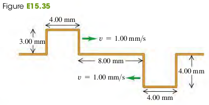

### 1506 Wave Interference Boundary Conditions and Superposition
We use *interference* to refer to what happens when two or more waves pass through the same region at the same time.

#### The Principle of Superposition
$$
\begin{aligned}
y(x, t) = y_1(x, t) + y_2(x, t)
\end{aligned}
$$

#### Exercises
32, 33, 34, 35

15.32 **Interference of Triangular Pulses**. Two triangular wave pulses are traveling toward each other on a stretched string as shown in Fig. E15.32. Each pulse is identical to the other and travels at $2.00 \text{ cm/s}$. The leading edges of the pulses are $1.00 \text{ cm}$ apart at $t = 0$. Sketch the shape of the string at $t = 0.250s, t = 0.500s, t = 0.750s, t = 1.000s$, and $t = 1.250 s$.

>Solution
Todo

15.33 Suppose that the left-traveling pulse in Exercise 15.32 is below the level of the unstretched string instead of above it. Make the same sketches that you did in that exercise.
>Solution
Todo

15.34 Two pulses are moving in opposite directions at $1.0\text{ cm/s}$ on a taut string, as shown in Fig. E15.34. Each square is $1.0$ cm. Sketch the shape of the string at the end of (a) $6.0 s$; (b) $7.0 s$; (c) $8.0 s$.

>Solution
Todo

15.35 Interference of Rectangular Pulses. Figure E15.35 shows two rectangular wave pulses on a stretched string traveling toward each other. Each pulse is traveling with a speed of $1.00 \text{ mm/s}$ and has the height and width shown in the figure. If the leading edges of the pulses are $8.00$ mm apart at $t = 0$, sketch the shape of the string at $t = 4.00 s, t = 6.00 s$, and $t = 10.0 s$.

>Solution
Todo
