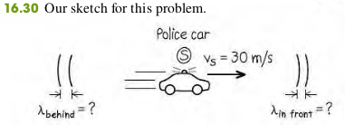
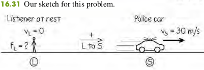
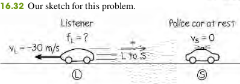
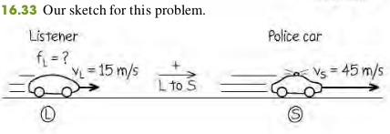

### 1608 The Doppler Effect
When a car approaches you with its horn sounding, the pitch seems to drop as the car passes. This phenomenon, first described by the 19th-century Austrian scientist Christian Doppler, is called the **Doppler effect**.

#### Moving Listener and Moving Source

Dopper effect for moving listener $L$ and moving source $S$:
$$
\begin{aligned}
f_L = \frac{v + v_L}{v + v_S} f_S \quad \bold{(16.29)}
\end{aligned}
$$
$f_L$ - Frequency heard by listener
$f_S$ - Frequency emitted by source
$v_L$ - Velocity of listener ( $+$ if from $L$ toward $S$, $-$ if opposite)
$v_S$ - Velocity of source ( $+$ if from $L$ toward $S$, $-$ if opposite)

#### Examples
16.14 A police car’s siren emits a sinusoidal wave with frequency f S = 300 Hz. The speed of sound is $340$ m/s and the air is still.
(a) Find the wavelength of the waves if the siren is at rest.
(b) Find the wavelengths of the waves in front of and behind the siren if it is moving at $30$ m/s.

>Solution
(a). When the source is at rest.
$$
\begin{aligned}
\lambda = \frac{v}{f_S} = \frac{340}{300} = 1.13 \text{ m}
\end{aligned}
$$
b. In front of the siren and behind the siren,
$$
\begin{aligned}
\lambda_{front} &= \frac{v-v_S}{f_S} = \frac{340-30}{300} = 1.03 \text{ m}\\
\lambda_{behind} &= \frac{v+v_S}{f_S} = \frac{340+30}{300} = 1.23 \text{ m}
\end{aligned}
$$

16.15 If a listener $L$ is at rest and the siren in Example 16.14 is moving away from $L$ at $30$ m/s, what frequency does the listener hear?

>Solution
We have $v_L = 0$ and $v_S = +30$ m/s (positive, since the velocity of the source in the direction from listenser to source)
$$
\begin{aligned}
f_L = \frac{v}{v+v_S} = \frac{340}{340 + 30} (300) = 276 \text{ Hz}
\end{aligned}
$$

16.16 If the siren is at rest and the listener is moving away from it at $30$ m/s, what frequency does the listener hear?

>Solution
The velocity of the listener is $v_L = - 30$ m/s (negative, since the motion
is in the direction from source to listener).
$$
\begin{aligned}
f_L = \frac{v - v_L}{v} = \frac{340 + (-30)}{340} (300) = 274 \text{ Hz}
\end{aligned}
$$

16.17 The siren is moving away from the listener with a speed of $45$ m/s relative to the air, and the listener is moving toward the siren with
a speed of $15$ m/s relative to the air. What frequency does the listener hear?

>Solution
Both the source velocity $v_S = + 45$ m/s and the listener’s velocity $v_L = + 15$ m/s are positive because both velocities are in the direction from listener to source.
$$
\begin{aligned}
f_L = \frac{v + v_L}{v + v_S} f_S = \frac{340 + 15}{340 + 45}(300) = 277 \text{ Hz}
\end{aligned}
$$

16.18 The police car is moving toward a warehouse at $30$ m/s. What frequency does the driver hear reflected from the warehouse?

>Solution
This situation has two Doppler shifts (Fig. 16.34). In the first shift, the warehouse is the stationary “listener.” The frequency of sound reaching the warehouse, which we call $f_W$, is greater than 300 Hz because the source is approaching. In the second shift, the warehouse acts as a source of sound with frequency $f_W$ , and the listener is the driver of the police car; she hears a frequency greater than $f_W$ because she is approaching the source.
The frequency reaching the warehouse is
$$
\begin{aligned}
f_W = \frac{v}{v + v_S} f_S = \frac{340}{340 + (-30)} (300) = 329 \text{ Hz}
\end{aligned}
$$
Then the frequency heard by the driver is
$$
\begin{aligned}
f_L = \frac{v + v_L}{v} f_W = \frac{340 + 30}{340)} (300) = 358 \text{ Hz}
\end{aligned}
$$

#### Exercises
44, 46, 48

16.44 In Example 16.18 (Section 16.8), suppose the police car is moving away from the warehouse at $20$ m/s. What frequency does the driver of the police car hear **reflected** from the warehouse?
>Solution
Todo

16.46 A railroad train is traveling at $25.0$ m/s in still air. The frequency of the note emitted by the locomotive whistle is $400$ Hz. What is the wavelength of the sound waves (a) in front of the locomotive and (b) behind the locomotive? What is the frequency of the sound heard by a stationary listener (c) in front of the locomotive and (d) behind the locomotive?
>Solution
Todo

16.48 **Moving Source vs. Moving Listener**. (a) A sound source producing 1.00-kHz waves moves toward a stationary listener at one-half the speed of sound. What frequency will the listener hear? (b) Suppose instead that the source is stationary and the listener moves toward the source at one-half the speed of sound. What frequency does the listener hear? How does your answer compare to that in part (a)? Explain on physical grounds why the two answers differ.
>Solution
Todo

#### Quiz
(10) If a sound source with a 1000HZ frequency moves away from the listener at 15m/s, and a listener moves a speed of 45m/s away from the source, what is the apparent frequence heard by the listener? (The velocity of sound is 340m/s)?
>Solution
Positive direction Listener -> Source
$$
\begin{aligned}
f_L = \frac{v-v_L}{v+v_S} f_S
\end{aligned}
$$
