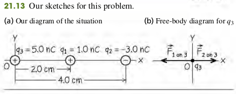
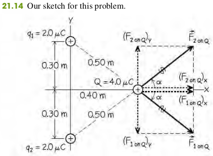

### 2103 Coulomb's Law

**Coulomb's Law**
The magnitude of the electric force between two point charges is directly proportional to the product of the charges and inversely proportional to the square of the distance between them.
The magnitude $F$ of the force that each of two point charges $q_1$ and $q_2$ a distance $r$ apart exerts on each other can be expressed as
$$
\begin{aligned}
F = k \frac{|q_1 q_2|}{r^2} \quad \bold{(21.1)}
\end{aligned}
$$

#### Fundamental Electric Constants
$$
\begin{aligned}
F = \frac{1}{4\pi \epsilon_0} \frac{|q_1 q_2|}{r^2} \quad \bold{(21.2)}
\end{aligned}
$$
The constants in Eq. (21.2) are approximately
$$
\begin{aligned}
\epsilon_0 &= 8.854 \times 10^{-12} C^2/N\cdot m^2\\
\frac{1}{4\pi \epsilon_0} &= k = 9.0 \times 10^9 N\cdot m^2/C^2
\end{aligned}
$$
The magnitude of the charge of an electron or a proton, denoted by $e$.
$$
\begin{aligned}
e = 1.602176565(35) \times 10^{19} C
\end{aligned}
$$

#### Example 21.3 Vector Addtion Of Electric Forces On A Line
Two point charges are located on the x-axis of a coordinate system: $q_1$ = 1.0 nC is at x = + 2.0 cm, and $q_2$ = -3.0 nC is at x = + 4.0 cm. What is the total electric force exerted by $q_1$ and $q_2$ on a charge $q_3$ = 5.0 nC at x = 0?

>Solution
$$
\begin{aligned}
F_{1 \text{ on } 3} &= \frac{k|q_1q_3|}{r_{13}^2} = 112 \mu N\\
F_{2 \text{ on } 3} &= \frac{k|q_2q_3|}{r_{23}^2}  = 84 \mu N\\
\vec F_{1 \text{ on } 3} &= (-112 \mu N)\hat i\\
\vec F_{2 \text{ on } 3} &= (84 \mu N)\hat i\\
\vec F_3 &= \vec F_{1 \text{ on } 3} + \vec F_{2 \text{ on } 3}\\
&= (-28\mu N)\hat i
\end{aligned}
$$

#### Example 21.4 Vector Addtion Of Electric Forces On A Plane
Two equal positive charges $q_1 = q_2 = 2.0 \mu C$ are located at x = 0, y = 0.30 m and x = 0, y = -0.30 m, respectively. What are the magnitude and direction of the total electric force that $q_1$ and $q_2$ exert on a third charge $Q = 4.0 \mu C$ at x = 0.40 m, y = 0?

>Solution
$$
\begin{aligned}
F_{1 \text{ or }2 \text{ On } Q} &= \frac{kq_1 Q}{r^2} = 0.29 \text{ N}
\end{aligned}
$$
The x-components of the two forces are equal:
$$
\begin{aligned}
(F_{1 \text{ or }2 \text{ On } Q} )_x &= F_{1 \text{ or }2 \text{ On } Q} \cos \alpha\\
&= 0.29 \text{ N} \times \frac{0.4 \text{ m}}{0.5 \text{ m}} = 0.23 \text{ N}
\end{aligned}
$$
From symmetry we see that the y-components of the two forces are equal and opposite. Hence their sum is zero and the total force $F$ on Q has only an x-component $F_x$ = 0.23 N + 0.23 N = 0.46 N. The total force on $Q$ is in the +x-direction, with magnitude 0.46 N.

#### Exercises
1, 2, 6, 7, 12, 16, 17

21.1 Excess electrons are placed on a small lead sphere with mass 8.00 g so that its net charge is $-3.20 \times 10^{-9}$ C.
(a) Find the number of excess electrons on the sphere.
(b) How many excess electrons are there per lead atom? The atomic number of lead is 82, and its atomic mass is 207 g/mol.
>Solution
a. Let the charge of the lead be $Q$, the number of excess electrons be $n_e$
$$
\begin{aligned}
Q &= 3.20 \times 10^{-9} \text{ C} \quad e = 1.60 \times 10^{-19} \text{ C}\\
n_e &= \frac{Q}{e} = 2\times 10^{10}
\end{aligned}
$$
b. Excess electrons per lead atom
$$
\begin{aligned}
\frac{2 \times 10^{10}}{\frac{8\text{ g}}{207 \text{ mol/g}} \times \frac{6.02 \times 10^{23}}{\text{mol}}} = 8.59 \times 10^{-13}
\end{aligned}
$$

21.2 Lightning occurs when there is a flow of electric charge (principally electrons) between the ground and a thundercloud. The maximum rate of charge flow in a lightning bolt is about 20,000 C/s; this lasts for 100 $\mu s$ or less. How much charge flows between the ground and the cloud in this time? How many electrons flow during this time?
>Solution
Let the rate of charge flow be $v$, the time be $t$, the total charge during this time be $Q$, and the number of electron be $n_e$
$$
\begin{aligned}
v &= 20000 \text{ C/s} \quad t = 10^{-4} \text{ s}\\
Q &= vt = 2 \text{ C}\\
n_e &= \frac{Q}{e} = 1.25\times 10^{19}
\end{aligned}
$$

21.6 Two small spheres spaced 20.0 cm apart have equal charge. How many excess electrons must be present on each sphere if the magnitude of the force of repulsion between them is $3.33 \times 10^{-21}$ N?
>Solution
Let the magnitude of the charge be $q$, the distance be $r$, and the magnitude of force be $F$
$$
\begin{aligned}
F &= 3.33 \times 10^{-21} \text{ N} \quad r = 0.2 \text{ m}\\
F &= \frac{kq^2}{r^2}\\
\to q &= \sqrt{\frac{Fr^2}{k}} = 1.22 \times 10^{-16} \text{ C}\\
n_e &= \frac{q}{e} = 761
\end{aligned}
$$

21.7 An average human weighs about 650 N. If each of two average humans could carry 1.0 C of excess charge, one positive and one negative, how far apart would they have to be for the electric attraction between them to equal their 650-N weight?
>Solution
Let the magnitude of the charge be $q$, the distance between the two be $r$, and the magnitude of the force be $F$
$$
\begin{aligned}
F &= 650 \text{N} \quad q = 1 \text{ C} \\
F &= \frac{kq^2}{r^2} \\
\to r &= \sqrt{\frac{kq^2}{F}} = 3721 \text{ m}
\end{aligned}
$$

21.12 A negative charge of -0.550 $\mu C$ exerts an upward 0.600-N force on an unknown charge that is located 0.300 m directly below the first charge. What are (a) the value of the unknown charge (magnitude and sign); (b) the magnitude and direction of the force that the unknown charge exerts on the -0.550 $\mu C$ charge?
>Solution
a. The unknow charge is positive. Let the negative charge be $q_1$, the unkonw charge be $q_2$, the distance be $r$, and the magnitude of the
force be $F$
$$
\begin{aligned}
F &= 0.6 \text{ N} \quad r = 0.3 \text{ m} \quad q_1 = -5.5\times 10^{-7} \text{ C}\\
F &= \frac{k|q_1q_2|}{r^2}\\
\to |q_2| &= \frac{Fr^2}{k|q_1|} = 1.1 \times 10^{-5} \text{ C}
\end{aligned}
$$
b. The unknow charge exerts a downward force of 0.6 N on the first negative charge.

21.17 Three point charges are arranged along the x-axis. Charge $q_1 = +3.00 \mu C$ is at the origin, and charge $q_2 = -5.00 \mu C$ is at x = 0.200 m. Charge $q_3 = - 8.00 \mu C$. Where is $q_3$ located if the net force on $q_1$ is 7.00 N in the - x-direction ?
>Solution
Todo
x=-0.144m
