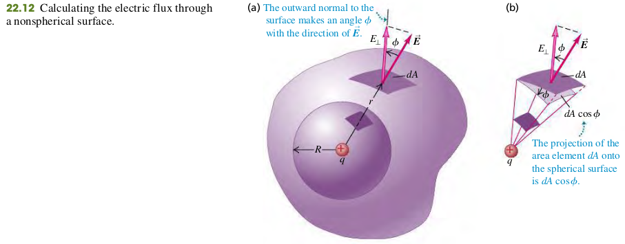

### 2203 Gauss's Law

#### Point Charge Inside a Spherical Surface
_The flux is independent of the radius $R$ of the sphere_. It depends on only the charge $q$ enclosed by the sphere.
$$
\begin{aligned}
\Phi_E = EA = \frac{1}{4\pi \epsilon_0} \frac{q}{R^2} (4\pi R^2) = \frac{q}{\epsilon_0}
\end{aligned}
$$

#### Point Charge Inside a Nonspherical Surface
We can devide the entire irregular surface into elements $dA$, compute the electric flux $EdA\cos \phi$ for each, and sum the results by integrating, as in Eq. (22.5) Each of the area elements projects onto a corresponding spherical surface element. Thus the total electric flux through the irregular surface, given by any forms of Eq. (22.5), must be the same as the toal flux through a sphere, which Eq. (22.6) shows is equal to $q/\epsilon_0$. Thus, for the irregular surfaces,
$$
\begin{aligned}
\Phi_E = \oint \vec{E}\cdot d\vec{A} = \frac{q}{\epsilon_0} \quad \bold{(22.7)}
\end{aligned}
$$

#### General Form of Gauss’s law
$$
\begin{aligned}
\Phi_E = \oint \vec{E}\cdot d\vec{A} = \frac{Q_{encl}}{\epsilon_0} \quad \bold{(22.8)}
\end{aligned}
$$
The total electric flux through a closed surface is eqaul to the total (net) electric charge inside the surface, divided by $\epsilon_0$.

#### Exercises
11

22.11 A 6.20 $\mu C$ point charge is at the center of a cube with sides of length 0.500 m. (a) What is the electric flux through one of the six faces of the cube? (b) How would your answer to part (a) change if the sides were 0.250 m long? Explain.
>Solution
$$
\begin{aligned}
\Phi_E &= \frac{1}{6} \cdot \frac{q}{\epsilon_0} = \frac{6.2\times 10^{-6}}{6 \times 8.85 \times 10^{-12}}\\
&= 1.17 \times 10^5 N\cdot m^2/C
\end{aligned}
$$
