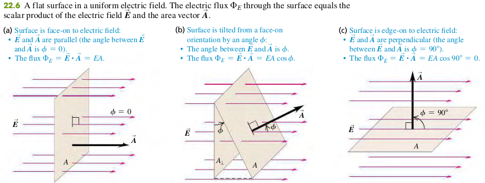
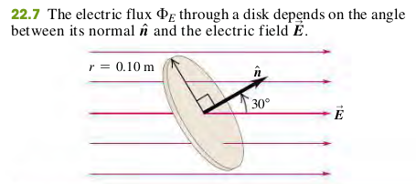
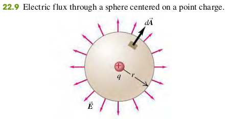

### 2202 Calculating Electric Flux

#### Flux of a Uniform Electric Field
The electric flux through a flat area $A$ perpendicular to a uniform electric field $\vec{E}$ is the product of the field magnitude $E$ and the area $A$:
$$
\begin{aligned}
\Phi_E = EA
\end{aligned}
$$
In terms of vector area $\vec{A}$ perpendicular to the area, we can write the electric flux as the scalar product of $\vec{E}$ and $\vec{A}$
$$
\begin{aligned}
\Phi_E = \vec{E} \cdot \vec{A} \quad \bold{(22.3)}
\end{aligned}
$$

#### Flux of a Nonuniform Electric Field
$$
\begin{aligned}
\Phi_E = \int E\cos \phi dA = \int E_\perp dA = \int \vec{E}\cdot d\vec{A} \quad \bold{(22.5)}
\end{aligned}
$$
$\phi$ - Angle between $\vec{E}$ and normal to surface
$dA$ - Element of surface area
$E_\perp$ - Component of $\vec{E}$ perpendicular to surface

#### EXAMPLE 22.1 ELETRIC FLUX THROUGH A DISK
A disk of radius 0.10 m is oriented with its normal unit vector $\hat n$ at 30$\degree$ to a uniform electric field $\vec{E}$ of magnitude $2.0\times 10^3 N/C$ (Fig. 22.7). (Since this isn’t a closed surface, it has no “inside”
or “outside.” That’s why we have to specify the direction of $\hat n$ in the figure.)
(a) What is the electric flux through the disk?
(b) What is the flux through the disk if it is turned so that $\hat n$ is perpendicula to $\vec{E}$?
(c) What is the flux through the disk if $\hat n$ is parallel to $\vec{E}$?

>Solution
a. The area $A = \pi(0.10m)^2 = 0.0314 m^2$, and the angle between $\vec{E}$ and $\vec{A} = A\hat n$ is $\phi = 30\degree$, so from Eq. (22.1),
$$
\begin{aligned}
\Phi_E &= EA\cos\phi = (2.0 \times 10^3 N/C) (0.0314 m^2)(\cos 30\degree)\\
&= 54 N\cdot m^2/C
\end{aligned}
$$
b. THe normal to the disk is now perpendiculaa to $\vec{E}$, so $\phi = 90 \degree$, and $\Phi_E = 0$.
c. THe normal to the disk is parallel to $\vec{E}$, so $\phi = 0$ and $\cos \phi = 1$:
$$
\begin{aligned}
\Phi_E &= EA\cos\phi = (2.0 \times 10^3 N/C) (0.0314 m^2)(1)\\
&= 63 N\cdot m^2/C
\end{aligned}
$$

#### EXAMPLE 22.2 ELETRIC FLUX THROUGH A SPHERE
A point charge $q = +3.0 \mu C$ is surrounded by an imaginary sphere of radius $r = 0.20$ m centered on the charge (Fig. 22.9). Find the resulting electric flux through the sphere.

>Solution
The surface is not flat and the electric field is not uniform, so to calculate the electric flux we must use the general definition, Eq. (22.5). Because the sphere is centered on the point charge, at any point on the spherical surface, $\vec{E}$ is directed out of the sphere perpendicular to the surface. The positive direction for both $\hat n$ and $E_\perp$ is outward, so $E_\perp = E$, and the flux through a surface element $dA$ is $\vec{E} \cdot \d\vec{A} = E dA$.
$$
\begin{aligned}
\Phi_E &= EA = \frac{q}{4\pi\epsilon_0 r^2} \cdot 4\pi r^2 = \frac{q}{\epsilon_0}\\
&= \frac{3.0 \times 10^{-6}}{8.85 \times 10^{12}} = 3.4 \times 10^5 N\cdot m^2/C
\end{aligned}
$$
