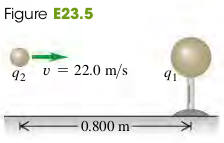

### 2301 Electric Potential Energy

#### Electric Potential Energy in a Uniform Field

#### Electric Potential Energy of Two Point Charges

#### Electric Potential Energy of Several Point Charges

#### Interpreting Electric Potential Energy

#### Exercises
5, 8

23.5 A small metal sphere, carrying a net charge of $q_1 = -2.80\mu C$, is held in a stationary position by insulating supports. A second small metal sphere, with a net charge of $q_2 = -7.80\mu C$ and mass 1.50g, is projected toward $q_1$. When the two spheres are 0.800m apart, $q_2$, is moving toward $q_1$ with speed 22.0 m/s. Assume that the two spheres can be treated as point charges. You can ignore the force of gravity.
(a) What is the speed of $q_2$ when the spheres are 0.400m apart?
(b) How close does $q_2$ get to $q_1$?

>Solution
Todo

23.8 Three equal $1.20\mu C$ point charges are placed at the cor­ners of an equilateral triangle with sides 0.400 m long. What is the potential energy of the system? (Take as zero the potential energy of the three charges when they are infinitely far apart.)
>Solution
Todo
