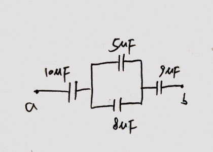

### 2402 Capacitors in Series And Parallel

#### Capacitors in Series
The reciprocal of the equivalent capcitance of a series combination equals the sume of the reciprocal of the individual capacitors.
$$
\begin{aligned}
\frac{1}{C_{eq}} = \frac{1}{C_1} + \frac{1}{C_2} + \frac{1}{C_3} + \cdots \quad \bold{(24.5)}
\end{aligned}
$$
>**Caution**
The magnitude of charge is the same on all plates of all capacitors in series combination. However, the potential difference of the individual capacitors are not the same unless their individual capacitances are the same.

#### Capacitors in Parallel
The equivalent capcitance of a parallel combination equals the sum of the individual capacitances.
$$
\begin{aligned}
C_{eq} &= C_1 + C_2 + C_3 + \cdots \quad\bold{(24.7)}
\end{aligned}
$$
>**Caution**
The potential difference are the same for all capacitors in a parallel combination, however, the chareges on individual capacitors are not the same unless their individual capacitances are the same.

#### Exercises
14

24.14 Figure E24.14 shows a system of four capacitors, where the potential difference across ab is 50.0 V. (a) Find the equivalent capacitance of this system between a and b. (b) How much charge is stored by this combination of capacitors? (c) How much charge is stored in each of the $10.0 \mu F$ and the $9 \mu F$ capacitors?

>Solution
a. The equivalent capacitance is
$$
\begin{aligned}
C_{eq} &= \frac{1}{\frac{1}{10\mu F} + \frac{1}{5\mu F + 8\mu F} + \frac{1}{9\mu F}}\\
&= 3.47 \mu F
\end{aligned}
$$
b. The stored charge is
$$
\begin{aligned}
Q &= C_{eq} V_{ab} = 3.47 \mu F \times 50.0 V\\
&= 1.74 \times 10^{-4}C
\end{aligned}
$$
c. The charge stored in the $10.0 \mu F$ and the $9 \mu F$ capacitors are both $Q = 1.74 \times 10^{-4}C$.
