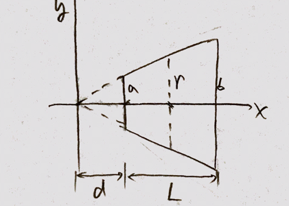

### 2503 Resistance

#### Challenge
See figure. The cross section of the resistor is circular. The radius of one end is $a$, and that of the other end is $b$, and the length of the resistor is $L$. The resistivity of the resistor is $\rho$. Find the resistance $R$.

>Solution
(1) According to similarity
$$
\begin{aligned}
\frac{d}{d + L} &= \frac{a}{b} \To d = \frac{aL}{b-a}
\end{aligned}
$$
The lower bound of x is $d = \dfrac{aL}{b-a}$, and the upper bound is $d + L = \dfrac{bL}{b-a}$
(2) The area of cross section is
$$
\begin{aligned}
\frac{x}{d + L} &= \frac{r}{b} \To r = \frac{(b-a)x}{L}\\
A &= \pi r^2 = \frac{\pi(b-a)^2 x^2}{L^2}
\end{aligned}
$$
(3) The resistance can be calcuated by integration.
$$
\begin{aligned}
dR &= \frac{\rho dx}{A} \quad(R = \frac{\rho L}{A})\\
R &= \int_{aL/(b-a)}^{bL/(b-a)} \frac{\rho}{\frac{\pi(b-a)^2 x^2}{L^2}} dx\\
&= \frac{\rho L^2}{\pi(b-a)^2} \int_{aL/(b-a)}^{bL/(b-a)} \frac{dx}{x^2}\\
&= \frac{\rho L}{\pi ab}
\end{aligned}
$$
