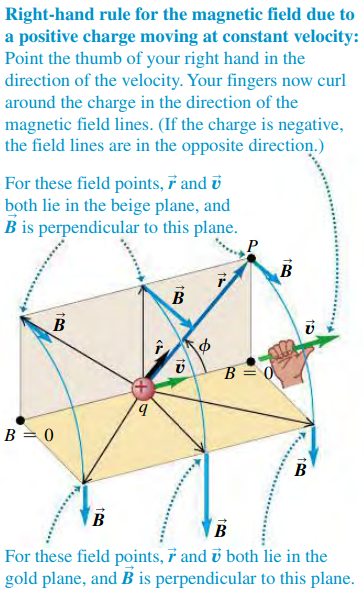
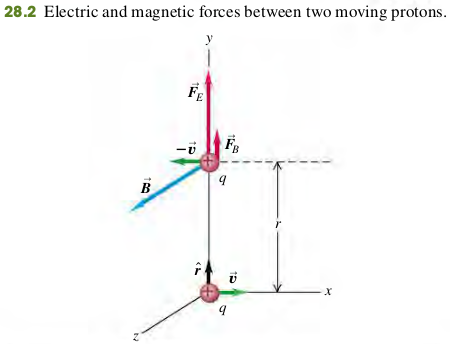

### 2801 Magnetic Field of a Moving Charge

#### Moving Charge: Vector Magnetic Field
The magnitude of $\vec{B}$ is proportional to $|q|$ and to $1/r^2$. But the direction of $\vec{B}$ is not along the line from source point to the field point. Instead, $\vec{B}$ is perpendicular to the plane containing this line and the particle's velocity vector $\vec{v}$. Furthermore, the field magnitude $B$ is also proportionalto the particles's speed $v$ and to the sine of the angle $\phi$.
$$
\begin{aligned}
\vec{B} &= \frac{\mu_0}{4\pi} \frac{q\vec{v} \times\hat r}{r^2}\\
B &= \frac{\mu_0}{4\pi} \frac{|q|v \sin{\phi}}{r^2}
\end{aligned}
$$
$\hat r$ - unit vector that points from the source point to the field point.
$r$ - distance from point charge to where field is measured.
$q$ - Charge
$\vec{v}$ - Velocity
$\mu_0$ - magnetic constant.

#### EXAMPLE 28.1 Forces Between Two Moving Protons
Two protons move parallel to the x-axis in opposite directions (Fig. 28.2) at the same speed $v$ (small compared to the speed of light $c$). At the instant shown, find the electric and magnetic forces on the upper proton and compare their magnitudes.

>Solution
Coulomb's Law gives the electric force $F_E$ on the upper proton. The magnetic force law gives the magnetic force on the upper proton.
The forces are replusive, so $F_E$ is vertically upward (+y-direction).
$$
\begin{aligned}
\vec{F_E} &= \frac{1}{4\pi \epsilon_0} \frac{q^2}{r^2} \jhat
\end{aligned}
$$
The velocity of the lower proton is $\vec{v} = v \ihat$. From right hand rule for the cross product $\vec{v} \times \hat r$, the $\vec{B}$ field due to the lowe proton at the position of the upper proton is in the +z-direction. The magnetic field is
$$
\begin{aligned}
\vec{B} = \frac{\mu_0}{4\pi} \frac{q(v\ihat) \times \jhat}{r^2} = \frac{\mu_0}{4\pi} \frac{qv }{r^2} \khat
\end{aligned}
$$
The velocity of the upper proton is $-\vec{v} = -v \ihat$. so the magnetic force on it is
$$
\begin{aligned}
\vec{F_B} &= q(-\vec{v}) \times \vec{B} \\
 &= q(-v\ihat) \times \frac{\mu_0}{4\pi} \frac{qv }{r^2} \khat\\
 &= \frac{\mu_0}{4\pi} \frac{q^2 v^2}{r^2} \jhat
\end{aligned}
$$
The magnetic interaction in this situation is also repulsive. The ratio of the force magnitude is
$$
\begin{aligned}
\frac{F_B}{F_E} &= \frac{\mu_0 q^2 v^2/4\pi r^2}{q^2 /4\pi \epsilon_0 r^2}\\
&= \mu_0\epsilon_0 v^2 \\
&= \frac{v^2}{c^2}
\end{aligned}
$$
When $v$ is small in comparison to the speed of the light, the magnetic force is much smaller than the electric force.
