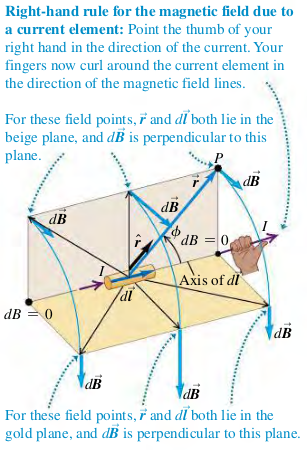
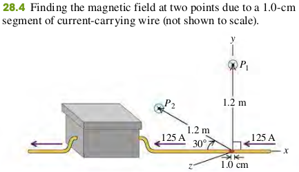

### 2802 Magnetic Field of a Current Element

The total magnetic field caused by several moving charges is the vector sum of field caused by the individual charges.

#### Current Element: Vector Magnetic Field

