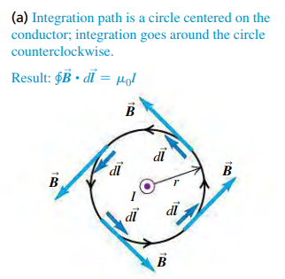
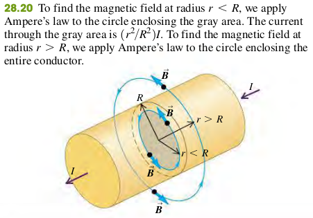
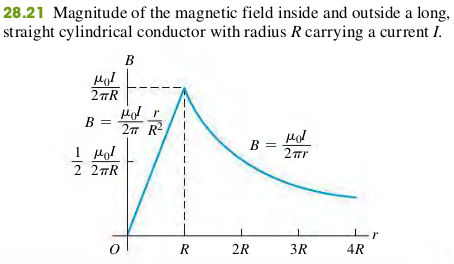
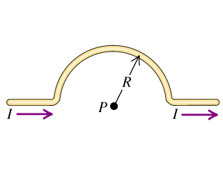

### 2806 Ampere's Law

Ampere's Law is formulated not in terms of magnetic flux, but rather in terms of line integrals of $\vec{B}$ around a closed path, denoted by
$$
\begin{aligned}
\oint \vec{B}\cdot d\vec{l}
\end{aligned}
$$
1. To evaluate this integral, we divide the path into infinitesimal segments $d\vec{l}$, calculate the scalar product of $\vec{B}\cdot d\vec{l}$ for each segment, and sum these products.
2. The circle on the integral sign indicates that this integral is always computed for a closed path, one whose beginning and end points are the same.

#### Ampere's Law For a Long Straight Conductor

At every point on the circle, $\vec{B}$ and $d\vec{l}$ are parallel, and so $\vec{B}\cdot d\vec{l} = B dl$; since $r$ is constant around the circle, $B$ is constant as well.
$$
\begin{aligned}
\oint \vec{B}\cdot d\vec{l} = B\oint dl = \frac{\mu_0 I}{2\pi r} (2\pi r) = \mu_0 I
\end{aligned}
$$

#### EXAMPLE 28.8 FIELD OF A LONG CYLINDRICAL CONDUCTOR
A cylindrical conductor with radius $R$ carries a current $I$ (Fig. 28.20). The current is uniformly distributed over the cross-sectional area of the conductor. Find the magnetic field as a function of the distance $r$ from the conductor axis for points both inside $(r < R)$ and outside $(r < R)$ the conductor.

#### Exercises
**28.34** Calculate the magnitude of the magnetic field at point P due to the current in the semicircular section of wire shown in the figure (Figure 1). (Hint: Does the current in the long, straight section of the wire produce any field at P?)

>Solution
$\dfrac{\mu_0 I}{4R}$
