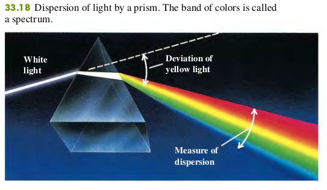

### 3304 Dispersion

Ordinary white light is a superposition of waves with all visible wavelengths. The speed of light in vacuum is the same for all wavelengths, but the speed in a material substance is different for different wavelengths. Therefore the index of refraction of a material depends on wavelength. The dependence of wave speed and index of refraction on wavelength is called **dispersion**.

#### Rainbow
