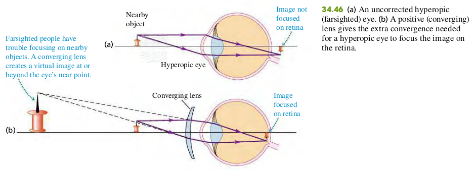
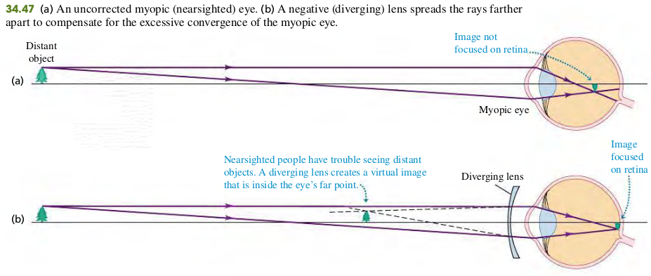
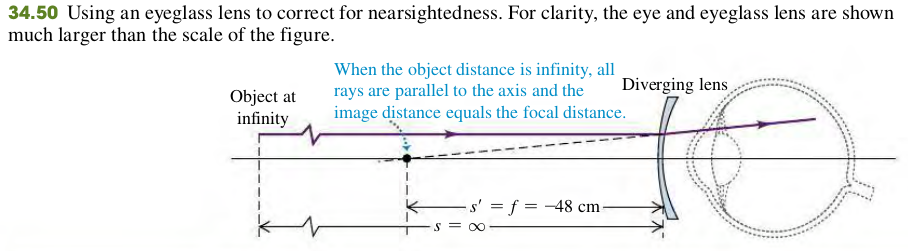

### 3406 The Eye

#### Example
34.14 The far point of a certain myopic eye is 50 cm in front of the eye. Find the focal length and power of the eyeglass lens that will permit the wearer to see clearly an object at infinity. Assume that the lens is worn 2 cm in front of the eye.

>Solution
Figure 34.50 shows the situation. The far point of a myopic eye is nearer than infinity. To see clearly objects beyond the far point, we need a lens that forms a virtual image of such objects no farther from the eye than the far point. Assume that the virtual image of the object at infinity is formed at the far point, 50 cm in front of the eye (48 cm in front of the eyeglass lens). Then when the object distance is $O = \infty$, we want the image distance to be $I = -48$ cm. As in Example 34.13, we use the values of s and s′ to calculate the required focal length.
$$
\begin{aligned}
\frac{1}{f} &= \frac{1}{O} + \frac{1}{I}\\
&= \frac{1}{\infty} + \frac{1}{-48}\\
\To f&= -48\text{cm}
\end{aligned}
$$
We need a diverging lens with focal length $f=-48$ cm and power of 1/(0.48 m) = -2.1 diopters.

#### Exercises
52, 53, 54

34.52 Contact lenses are placed right on the eyeball, so the distance from the eye to an object (or image) is the same as the distance from the lens to that object (or image). A certain person can see distant objects well, but his near point is 48.0 cm from his eyes instead of the usual 25.0 cm.
(a) Is this person nearsighted or farsighted?
(b) What type of lens (converging or diverging) is needed to correct his vision?
(c) If the correcting lenses will be contact lenses, what focal length lens is needed ?
(d) What is the power corresponding to the focal length found in part (C) in diopters?
>Solution
a. Farsighted.
b. Converging Lens
c. $f=52.2\text{cm}$
d. $\frac{1}{f} = 1.92 \text{ diopters}$

34.53 Ordinary Glasses. Ordinary glasses are worn in front of the eye and usually 2.0 cm in front of the eyeball. Suppose that the person in Exercise 34.52 prefers ordinary glasses to contact lenses. What focal length lenses are needed to correct his vision, and what is their power in diopters?
>Solution
Todo

34.54 A person can see clearly up close, but cannot focus on objects beyond 78.0 cm. She opts for contact lenses to correct her vision.
(a) Is she nearsighted or farsighted?
(b) What type of lens (converging or diverging) is needed to correct her vision?
(c) What focal-length contact lens is needed?
(d) What is the power of the contact lens in diopters?
>Solution
a. Nearsighted.
b. Divering Lens
c. $f=-78\text{cm}$
d. $\frac{1}{f} = -1.28 \text{ diopters}$
