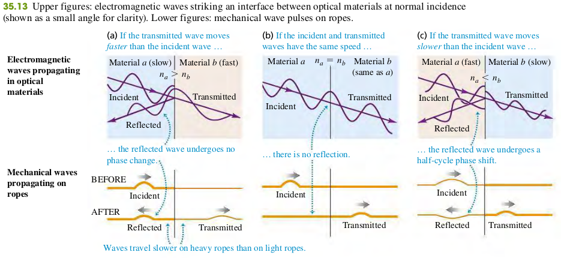
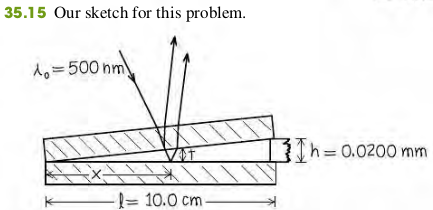

### 3504 Interference in the Thin Films

#### Thin-film Interference and Phase Shifts during reflection
Suppose a light wave with electric-field amplitude $E_i$ is traveling in an optical material with index of refraction $n_a$. It strikes, at normal incidence, an interface with another optical material with index $n_b$. The amplitude $E_r$ of the wave reflected from the interface is given by
$$
\begin{aligned}
E_r = \frac{n_a - n_b}{n_a+n_b}E_i \quad \text{Normal incidence} \quad \bold{(35.16)}
\end{aligned}
$$

If the film has thickness t, the light is at normal incidence and has wavelength $\lambda$ in the film; if neither or both of the reflected waves from the two surfaces have a half-cycle reflection phase shift, the conditions for constructive and destructive interference are
**Constructive reflection**
$$
\begin{aligned}
2t = m\lambda \quad (m=0, 1, 2, \cdots) \quad \bold{(35.17a)}
\end{aligned}
$$
**Destructive reflection**
$$
\begin{aligned}
2t = (m + \frac{1}{2}) \lambda \quad (m=0, 1, 2, \cdots) \quad \bold{(35.17b)}
\end{aligned}
$$
If one of the two waves has a half-cycle reflection phase shift, the conditions for constructive and destructive interference are reversed:
**Constructive reflection**
$$
\begin{aligned}
2t = (m + \frac{1}{2}) \lambda \quad (m=0, 1, 2, \cdots) \quad \bold{(35.18b)}
\end{aligned}
$$
**Destructive reflection**
$$
\begin{aligned}
2t = m\lambda \quad (m=0, 1, 2, \cdots) \quad \bold{(35.18a)}
\end{aligned}
$$

#### Examples
Suppose the two glass plates in Fig. 35.12 are two microscope slides 10.0 cm long. At one end they are in contact; at the other end they are separated by a piece of paper 0.0200 mm thick. What is the spacing of the interference fringes seen by reflection? Is the fringe at the line of contact bright or dark? Assume monochromatic light with a wavelength in air of $\lambda = \lambda_0 = 500$ nm.

>Solution
**Identify and Set Up**: Figure 35.15 depicts the situation. We'll consider only the interference between the light reflected from the upper and lower surface of the air wedge between the microscope slids. [The top slide has a relatively great thickness, about 1 mm, so we can ignore interference between the light reflected from its upper and lower surfaces  (see Fig. 35.14b)]. Light travels more slowly in the glass of the slides than it does in a air. Hence the wave reflected from the upper surface of the air wedge has no phase shift, while the wave reflected from the lower surface has a half-cycle phase shift (see Fig. 35.13c)
**Execute**: Since only one of the reflected waves undergoes a phase shift, the condition for destructive interference (a dark fringe) is Eq. (35.18b):
$$
\begin{aligned}
2t = m \lambda  \quad (m=0, 1, 2, \cdots)
\end{aligned}
$$
From similar triangles in Fig. 35.15 the thickness t of the air wedge at each point is proportional to the distance x from the line of contact.
$$
\begin{aligned}
\frac{t}{x} = \frac{h}{l}
\end{aligned}
$$
Combining this with Eq. (35.18b), we find
$$
\begin{aligned}
\frac{2xh}{l} &= m \lambda_0\\
x &= m \frac{l \lambda_0}{2h} = m(1.25) \text{ mm}
\end{aligned}
$$
Successive dark fringes, corresponding to $m=1, 2, 3 \cdots$ are spaced 1.25 mm apart. Substituting $m=0$ into this equation gives $x=0$, which is where two slides touch (at the left-hand side of Fig. 35.15). Hence this a dark fringe at the line of contact.

#### Exercises
29

35.29 The walls of a soap bubble have about the same index of refraction as that of plain water, n=1.33. There is air both inside and outside the bubble.
(a) What wavelength (in air) of visible light is most strongly reflected from a point on a soap bubble where its wall is 290 nm thick?
(b) To what color does this correspond (see figure 32.4 and table 32.1 in the textbook)?
(c) What wavelength (in air) of visible light is most strongly reflected from a point on a soap bubble where its wall is 340 nm thick?
(d) To what color does this correspond (see figure 32.4 and table 32.1 in the textbook)?
>Solution
First, for the visible light to be most strongly reflected, constructive interference occurs. Second, the light reflected from the outer surface of the bubble wall has no phase shift, the light reflected from the inner surface of the bubble wall undergoes a phase shift, the condition for constructive interference is
$$
\begin{aligned}
2t &= (m + \frac{1}{2}) \lambda_{water}\\
2t n_{water} &= (m + \frac{1}{2}) \lambda_{air}\\
\To \lambda_{air} &= \frac{2t n_{water}}{(m + \frac{1}{2})}\\
m = &0, t_1 = 2.9 \times 10^{-7} \text{ m} \To \lambda_{air1} = 514 \text{ nm}\\
m = &0, t_1 = 3.4 \times 10^{-7} \text{ m} \To \lambda_{air2} = 603 \text{ nm}\\
\end{aligned}
$$
a. 514 nm, yellow
b. 603 nm, orange
