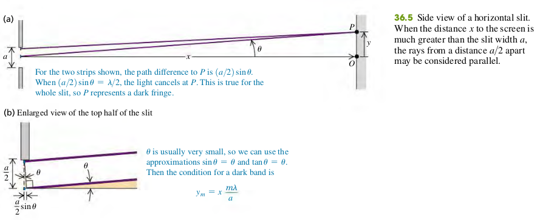
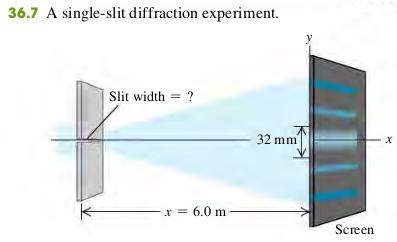

### 3602 Diffraction From a Single Slit
Monochromatic light sent through a narrow slit of width a produces a diffraction pattern on a distant screen. Equation (36.2) gives the condition for destructive interference (a dark fringe) at a point P in the pattern at angle u. Equation (36.7) gives the intensity in the pattern as a function of u. (See Examples 36.1–36.3.)

**Dark fringes, single slit diffraction**
$$
\begin{aligned}
\sin \th = \frac{m \lambda}{a} \quad (m=\pm 1, \pm 2, \cdots) \quad \bold{(36.2)}
\end{aligned}
$$
$\th$ - Angle of line from center of slit to *m*th dark fringe on screen
$a$ - Slit width
$\lambda$ - Wavelength
If the distance from slit to screen is $x$, the vertical distance of the *m*th dark band from the center of the patter is $y_m$, then $\tan \th = y_m/x$. For small $\th$ we may also approximate $\tan \th$ by $\th$ (in radians), We then find
$$
\begin{aligned}
y_m = x\frac{m \lambda}{a} \quad (y_m << x) \quad \bold{(36.3)}
\end{aligned}
$$

#### Examples
36.1  You pass 633-nm laser light through a narrow slit and observe the diffraction pattern on a screen 6.0 m away. The distance on the screen between the centers of the first minima on either side of the central bright fringe is 32 mm (Fig. 36.7). How wide is the slit?

>Solution
The first minimum corresponds to m = 1 in Eq. (36.3). The distance y 1 from the central maximum to the first minimum on either side is half the distance between the two first minima, so $y_1 = 32/2= 16$ mm. Solving Eq. (36.3) for $a$, we find
$$
\begin{aligned}
a = x\frac{\lambda}{y_1} = 0.24\text{ mm}
\end{aligned}
$$

#### Exercises
1, 2, 3, 5, 11

36.1 Monochromatic light from a distant source is incident on a slit 0.750 mm wide. On a screen 2.00 m away, the distance from the central maximum of the diffraction pattern to the first minimum is measured to be 1.35 mm. Calculate the wavelength of the light.
>Solution
Solving $y_m = x \dfrac{m \lambda}{a}$, for $\lambda$
$$
\begin{aligned}
\lambda &= \frac{y_m a}{x m}\\
y_m &= 1.35 \times 10^{-3} \text{ m}, a = 0.75 \times 10^{-3} \text{ m}, x = 2\text{m}, m = 1\\
\To \lambda &= 506.25 \text{ nm}
\end{aligned}
$$

36.2 Parallel rays of green mercury light with a wavelength of 546 nm pass through a slit covering a lens with a focal length of 60.0 cm. In the focal plane of the lens, the distance from the central maximum to the first minimum is 8.65 mm. What is the width of the slit?
>Solution
The lens here makes the rays parallel. In this case, m = 1
$$
\begin{aligned}
\sin\th &\approx \tan\th = \frac{0.865}{60}\\
\sin\th &= \frac{m \lambda}{a} \\
\To a&= \frac{m \lambda}{\sin\ \th} =  0.038 \text{ mm} 
\end{aligned}
$$

36.3 Light of wavelength 585 nm falls on a slit 0.0666 mm wide.
(a) On a very large and distant screen, how many totally dark fringes (indicating complete cancellation) will there be, including both sides of the central bright spot? Solve this problem without calculating all the angles! (Hint: What is the largest that $\sin \th$ can be? What does this tell you is the largest that m can be?)
(b) At what angle will the dark fringe that is most distant from the central bright fringe occur?
>Solution
$$
\begin{aligned}
\sin \th &= \frac{m \lambda}{a} < 1\\
\lambda &= 585 \text{ nm}, a = 0.0666 \text{ mm}\\
\To & m < 113.9
\end{aligned}
$$
There are 113 dark fringe at one side of the center bright spot, the total will be 113 * 2 = 226. When m = 113, $\th = \pm 83 \degree$.

36.5 Diffraction occurs for all types of waves, including sound waves. High-frequency sound from a distant source with wavelength 9.00 cm passes through a slit 12.0 cm wide. A microphone is placed 8.00 m directly in front of the center of the slit, corresponding to point O in Fig. 36.5a. The microphone is then moved in a direction perpendicular to the line from the center of the slit to point O. At what distances from O will the intensity detected by the microphone be zero?
>Solution
For the intensity to be zero, the destructive interference occurs (Dark fringe).
$$
\begin{aligned}
\sin \th &= \frac{m \lambda}{a} = \frac{3}{4}
\end{aligned}
$$
And (Small angle approximation does not apply, as the angle is not small)
$$
\begin{aligned}
\tan \th &= \frac{y}{8}
\end{aligned}
$$
Solve for $y$
$$
\begin{aligned}
y &= 8\tan \th \\
&= 8 \times \frac{3}{\sqrt 7} = 9.07 \text{ m}
\end{aligned}
$$

36.11 Red light of wavelength 633 nm from a helium–neon laser passes through a slit 0.350 mm wide. The diffraction pattern is observed on a screen 3.00 m away. Define the width of a bright fringe as the distance between the minima on either side.
(a) What is the width of the central bright fringe?
(b) What is the width of the first bright fringe on either side of the central one?
>Solution
The distance from the first minima to the center of the bright fringe is
$$
\begin{aligned}
y_1 &= x\frac{m \lambda}{a}\\
x &= 3 \text{ m}, m = 1, \lambda = 6.33 \times 10^{-7} \text{ m}, a = 0.35 \times 10^{-3} \text{ m}\\
\To y_1 &= 5.43 \text{ mm}
\end{aligned}
$$
The width of the central bright fringe is $2y_1$ = 10.9 mm. The width of the first bright fringe on either side of the central one is 5.43 mm.
