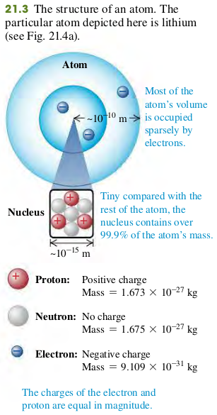

### 2101 Electric Charge
Two positive charges or two negative charges repel each other. A positive charge and a negative charge attract each other.

#### Electric charge and the structure of Matter
The structure of atoms can be described in terms of three particles: the negatively charged **electron**, the positively charged **proton**, and the uncharged **neutron** (Fig. 21.3).

Mass of electron $m_e = 9.109 \times 10^{-31} \text{ kg}$
Mass of proton $m_p = 1.673 \times 10^{-27} \text{ kg}$
Mass of neutron $m_n = 1.675 \times 10^{-27} \text{ kg}$

### Electric charge is conserved
+ The algebraic sum of all the electric charges in any closed system is constant.
+ The magnitude of charge of the electron or proton is a natural unit of charge.

#### Exercises
None
