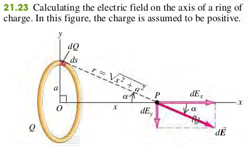
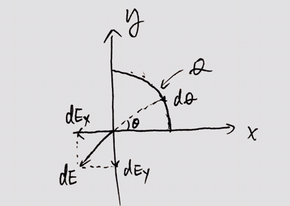
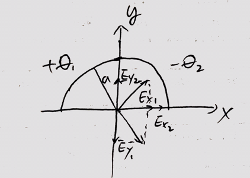

### 2105 Electric Field Calculations

#### The Superposition of Electric Field
The total electric field at $P$ is the vector of the fields at $P$ due to each point charge in the charge distribution.
$$
\begin{aligned}
\vec{E} = \vec{E_1} + \vec{E_2} + \vec{E_3} + \cdots
\end{aligned}
$$

+ $\lm$ - linear charge density
+ $\sigma$ - surface charge density
+ $\rho$ - volume charge density

#### Example 21.9 Field of A Ring of Charge
Charge Q is uniformly distributed around a conducting ring of radius a (Fig. 21.23). Find the electric field at a point P on the ring axis at a distance x from its center.

>Solution
$E = \dfrac{kQx}{(a^2 + x^2)^{\frac{3}{2}}} \hat i$

#### Example 21.11 Field of A Uniformly Charged Disk
A nonconducting disk of radius $R$ has a uniform positive surface charge density $\sigma$. Find the electric field at a point along the axis of the disk a distance $x$ from its center. Assume that x is positive.

>Solution
$E = \frac{\sigma}{2\epsilon_0}$
A typical ring has charge $dQ$, inner radius $r$, and outer radius $r + dr$. Its area is approximately equal to its width $dr$ times its circumference $2\pi r$, or $dA = 2\pi r dr$. The charge per unit area is $\sigma = dQ/dA$, so the charge of the ring is $dQ = \sigma dA = 2\pi \sigma r dr$.
The expression for the field due to a ring that we found in example 21.9,
$$
\begin{aligned}
dE_x &= \frac{1}{4\pi \epsilon_0} \frac{2\pi \sigma r x dr}{(x^2 + r^2)^{3/2}}
\end{aligned}
$$
To find the total field due to all the rings, we integrate $dE_x$, over $r$ from $r=0$ to $r=R$ (not from $-R$ to $R$):
$$
\begin{aligned}
E_x &= \int_0^R \frac{1}{4\pi \epsilon_0} \frac{2\pi \sigma r x dr}{(x^2 + r^2)^{3/2}}\\
&= \frac{\sigma x}{4 \epsilon_0} \int_0^R \frac{2 r dr}{(x^2 + r^2)^{3/2}}\\
&= \frac{\sigma x}{2 \epsilon_0} \lb -\frac{1}{\sqrt{x^2 + R^2} + \frac{1}{x}} \rb\\
&= \frac{\sigma}{2 \epsilon_0} \lb 1 -\frac{1}{\sqrt{R^2/x^2 + 1}} \rb \quad \bold{(21.11)}
\end{aligned}
$$
If the disk is very large (or if we are close to it), so that $R \gg x$, the term $\frac{1}{\sqrt{R^2/x^2 + 1}}$ is very much less than 1. Then Eq. (21.11) becomes
$$
\begin{aligned}
E = \frac{\sigma}{2\epsilon_0} \quad \bold{(21.12)}
\end{aligned}
$$
Our final result does not contain the distance $x$ from the plane. Hence the electric field produced by an infinite plane sheet of charge is independent of the distance from the sheet. The field direction is everywhere perpendicular to the sheet, away from it. There is no such thing as an infinite sheet of charge, but if the dimensions of the sheet are much larger than the distance $x$ of the field point $P$ from the sheet, the field is very nearly given by Eq. (21.12)

#### Example 21.12 Field of Two Oppositely Charged Infinite Sheets
Two infinite plane sheets with uniform surface charge densities $+\sigma$ and $-\sigma$  are placed parallel to each other with separation d(Fig. 21.26). Find the electric field between the sheets, above the upper sheet, and below the lower sheet.

>Solution
$$
\begin{aligned}
\vec E = \vec E_1 + \vec E_2 = \begin{cases}
0 &\text{Above the upper sheet}\\
\frac{\sigma}{\epsilon_0}\jhat &\text{Between the sheets}\\
0 &\text{Below the upper sheet}
\end{cases}
\end{aligned}
$$

#### Exercises
36, 38, 42, 43, 62, 65, 79, 82, 85, 86, 88

21.36 Two point charges Q and +q (where q is positive) produce the net electric field shown at point P in Fig. E21.36. The field points parallel to the line connecting the two charges.
(a) What can you conclude about the sign and magnitude of Q? Explain your reasoning.
(b) If the lower charge were negative instead, would it be possible for the  field to have the direction shown in the figure? Explain your reasoning.

21.38 The two charges $q_1$ and Figure E21.38 $q_2$ shown in Fig. E21.38 have equal magnitudes. What is the direction of the net electric field due to these two charges at points A (midway between the charges), B, and C if (a) both charges are negative, (b) both charges are positive, (c) $q_1$ is positive and $q_2$ is negative.

21.79 Positive charge Q is distributed uniformly along the x-axis from $x = 0$ to $x = a$. A positive point charge q is located on the positive x-axis at $x = a + r$, a distance $r$ to the right of the end of Q (Fig. P21.79).
(a) Calculate the x- and y-components of the electric field produced by the charge distribution Q at points on the positive x-axis where $x > a$.
(b) Calculate the force (magnitude and direction) that the charge distribution Q exerts on q.
(c) Show that if $r \gg a$, the magnitude of the force in part (b) is approximately $Qq /4\pi \epsilon_0 r^2$. Explain why this result is obtained.

>Solution
a. Let the charge density be $\lm = \dfrac{Q}{a}$. At point x, the y-component of electric field is zero, and the x-component of electric field is the electri field produced by $dQ$ of the charge distribution Q.
$$
\begin{aligned}
dQ &= \lm dx\\
dE_x &= \frac{k dQ}{(a+r-x)^2} = \frac{k \lm dx}{(a+r-x)^2}\\
E_x &= k \lm \int_0^a \frac{dx}{(a+r-x)^2}\\
&= k \lm \bigg(\frac{1}{a+r-x}\bigg) \bigg\vert_0^a\\
&= \frac{k \lm \cdot a}{r(a+r)}\\
&= \frac{k Q}{r(a+r)}\\
E &= E_x \hat i = \frac{k Q}{r(a+r)} \hat i
\end{aligned}
$$
b. The electric force $\vec F = Eq = \dfrac{k Qq}{r(a+r)} \hat i$. The direction is +x-axis.
c. When $r \gg a$,
$$
\begin{aligned}
r(a+r) &\approx r^2\\
F &= \frac{k Qq}{r(a+r)} \\
&=\frac{k Qq}{r^2} = \frac{Qq}{4\pi \epsilon_0 r^2}
\end{aligned}
$$

21.82 Positive charge Q is distributed uniformly along the positive y-axis between $y = 0$ and $y = a$. A negative point charge $-q$ lies on the positive Q x-axis, a distance $x$ from the origin.
(a) Calculate the x- and y-components of the electric field produced by the charge distribution Q at points on the positive x-axis.
(b) Calculate the x- and y-components of the force that the charge distribution Q exerts on q.
(c) Show that if $x \gg a$, $F_x \approxeq \dfrac{-Qq}{4\pi\epsilon_0 x^2}$ and $F_y \approxeq \dfrac{+Qqa}{8\pi\epsilon_0 x^3}$. Explain why this result is obtained.

>Solution
Let the charge density be $\lm = Q/a$, we have $dQ = \lm \cdot dy$
The x-component of the electric field is
$$
\begin{aligned}
dE_x &= \frac{kdQ}{r^2} \cos \th\\
&= k \lm dy \cdot \frac{1}{x^2 + y^2} \cdot \frac{x}{\sqrt{x^2 + y^2}}\\
&= k \lm x\cdot \frac{1}{(x^2 + y^2)^{\frac{3}{2}}}\cdot dy\\
E_x &= k\lm x \int_0^a \frac{1}{(x^2 + y^2)^{\frac{3}{2}}}dy\\
&= \frac{kQx}{a} \big(\frac{y}{x^2\sqrt{x^2 + y^2}}\big)\big\vert_0^a\\
&= \frac{kQ}{x\sqrt{x^2 + a^2}}
\end{aligned}
$$
The y-component of the electric field is
$$
\begin{aligned}
dE_y &= \frac{kdQ}{r^2} \sin \th\\
&= k \lm dy \cdot \frac{1}{x^2 + y^2} \cdot \frac{y}{\sqrt{x^2 + y^2}}\\
&= k \lm \cdot \frac{y}{(x^2 + y^2)^{\frac{3}{2}}}\cdot dy\\
E_y &= k\lm \int_0^a \frac{y}{(x^2 + y^2)^{\frac{3}{2}}}dy\\
&= \frac{kQ}{a} \big(-\frac{1}{\sqrt{x^2 + y^2}}\big)\big\vert_0^a\\
&= \frac{kQ}{a} \big( \frac{1}{x} - \frac{1}{\sqrt{x^2 + a^2}}\big)
\end{aligned}
$$
c. Hint: $(1 + z)^n = 1 + nz + \cdots$
$$
\begin{aligned}
\frac{1}{\sqrt{x^2 + a^2}} &= \frac{1}{x} (1-\frac{a^2}{2x^2})\\
F_x = - E_x q &= \frac{kQ}{x\sqrt{x^2 + a^2}}\\
&=-\frac{kQ}{x^2}(1-\underbrace{\frac{a^2}{2x^2}}_{\blue{approaches 0}})\\
&=-\frac{kQ}{x^2} = \frac{-Qq}{4\pi\epsilon_0 x^2}\\
F_y = E_y q &= \frac{kQq}{a} \big( \frac{1}{x} - \frac{1}{\sqrt{x^2 + a^2}}\big)\\
&= \frac{kQ}{a} \cdot \frac{1}{x} \big(1 - 1 + \frac{a^2}{2x^2}\big)\\
&= \frac{kQa}{2x^3} =\frac{+Qqa}{8\pi\epsilon_0 x^3}
\end{aligned}
$$

21.85 Negative charge $-Q$ is distributed uniformly around a quarter-circle of radius $a$ that lies in the first quadrant, with the center of curvature at the origin. Find the x- and y-components of the net electric field at the origin.

>Solution
Let the magnitude of the charge density be $\d\lm = \frac{Q}{a\cdot \frac{\pi}{2}} = \frac{2Q}{\pi a}$.
$$
dQ = \lm \cdot a d\th = \frac{2Q}{\pi}d\th
$$
The x-component of the electri field is
$$
\begin{aligned}
dE_x &= \frac{k dQ}{a^2} \cos \th\\
E_x &= \frac{k}{a^2} \cdot \frac{2Q}{\pi} \int_0^{\pi/2} \cos \th d\th\\
&= \frac{2kQ}{\pi a^2} (\sin \th) \big\vert_0^{\pi/2}\\
&= \frac{2kQ}{\pi a^2}
\end{aligned}
$$
The y-component of the electri field is
$$
\begin{aligned}
dE_y &= \frac{k dQ}{a^2} \sin \th\\
E_y &= \frac{k}{a^2} \cdot \frac{2Q}{\pi} \int_0^{\pi/2} \sin \th d\th\\
&= \frac{2kQ}{\pi a^2} (-\cos \th) \big\vert_0^{\pi/2}\\
&= \frac{2kQ}{\pi a^2}
\end{aligned}
$$

21.86 A semicircle of radius $a$ is in the first and second quadrants, with the center of curvature at the origin. Positive charge $+Q$ is distributed uniformly around the left half of the semicircle, and negative charge $-Q$ is distributed uniformly around the right half of the semicircle (Fig. P21.86). What are the magnitude and direction of the net electric field at the origin produced by this distribution of charge?

>Solution
Let the electric field of positive charge be $E_1$, and that of negative charge be $E_2$. From (21.85), we know that
$$
\begin{aligned}
E_1 &= \frac{2kQ}{\pi a^2} \ihat -\frac{2kQ}{\pi a^2} \jhat\\
E_2 &= \frac{2kQ}{\pi a^2} \ihat +\frac{2kQ}{\pi a^2} \jhat\\
E_{total} &= E_1 + E_2\\
&= \frac{4kQ}{\pi a^2} \ihat
\end{aligned}
$$

21.88 Two very large parallel sheets are 5.00 cm apart. Sheet A carries a uniform surface charge density of $-8.80\mu C/m^2$, and sheet B, which is to the right of A, carries a uniform charge density of $-11.6\mu C/m^2$. Assume that the sheets are large enough to be treated as infinite. Find the magnitude and direction of the net electric field these sheets produce at a point (a) 4.00 cm to the right of sheet A; (b) 4.00 cm to the left of sheet A; (c) 4.00 cm to the right of sheet B.
>Solution
The electric field produced by a uniformly charged sheet at any distance is given by
$$
\begin{aligned}
E = \frac{\sigma}{2\epsilon_0}
\end{aligned}
$$
Sheet A gives an electric field of
$$
\begin{aligned}
E_A &= \frac{\sigma}{2\epsilon_0} = \frac{-8.8 \times 10^{-6}}{2\cdot 8.85 \times 10^{-12}}\\
&= -4.97 \times 10^5 N/C
\end{aligned}
$$
where the negative sign means the field points towards sheet A, in any point of the space.
The electric field produced by sheet B is given by
$$
\begin{aligned}
E_B &= \frac{\sigma}{2\epsilon_0} = \frac{-11.6 \times 10^{-6}}{2\cdot 8.85 \times 10^{-12}}\\
&= -6.55 \times 10^5 N/C
\end{aligned}
$$
and again, the negative sign means that the field at any point of the space points towards sheet B.
a. 4.00 cm to the right of sheet A (between the two sheets)
$$
\begin{aligned}
E &= E_A - E_B = -4.97 \times 10^5 N/C - (-6.55 \times 10^5 N/C)\\
&= 1.58 \times 10^5 N/C
\end{aligned}
$$
And the direction is towards sheet B.
b. 4.00 cm to the left of sheet A
$$
\begin{aligned}
E &= E_A + E_B = -4.97 \times 10^5 N/C + (-6.55 \times 10^5 N/C)\\
&= -11.52\times 10^5 N/C
\end{aligned}
$$
towards right.
c. 4.00 cm to the right of sheet B.
$$
\begin{aligned}
E &= E_A + E_B = -4.97 \times 10^5 N/C + (-6.55 \times 10^5 N/C)\\
&= -11.52\times 10^5 N/C
\end{aligned}
$$
toward left.
