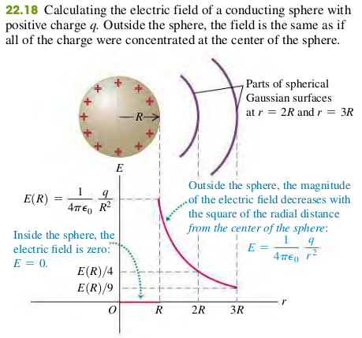
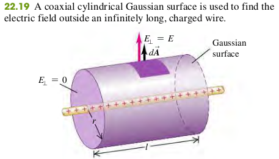

### 2204 Applications of Gauss's Law

#### EXAMPLE 22.5 FIELD OF A CHARGED CONDUCTING SPHERE
We place a total positive charge $q$ on a solid conducting sphere with radius $R$. Find $\vec{E}$ at any point inside or outside the sphere.

>Solution
Todo

#### EXAMPLE 22.6 FIELD OF A UNIFORM LINE CHARGE
Electric charge is distributed uniformly along an infinitely long, thin wire. The charge per unit length is l (assumed positive). Find the electric field by using Gauss's law.

The flux through the flat ends of our Gaussian surface is zero because the radial electric field os parallel to these ends, and so $\vec E \cdot \hat n = 0$. On the cylindrical part of our surface we have $\vec E \cdot \hat n = E_\perp = E$ everwhere. If $\lm$ were negative, we would have $\vec E \cdot \hat n = E_\perp = -E$ everwhere. The area of the cylindrical surface is $2\pi rl$, so the flux through it-and hence the total flux $\Phi_E$ through the Gaussian surface -  is $EA = 2\pi rl E$. The total enclosed charge is $Q_{encl} = \lm l$, and so from Gauss's Law, Eq. (22.8)
$$
\begin{aligned}
\Phi_E &= EA = 2\pi rl E = \frac{\lm l}{\epsilon_0}\\
\To E &= \frac{1}{2\pi \epsilon_0} \cdot \frac{\lm}{r}
\end{aligned}
$$

#### EXAMPLE 22.7 FIELD OF AN INFINITE PLANE SHEET OF CHARGE
Use Gauss's law to find the electric field caused by a thin, flat, infinite sheet with a uniform positive surface charge density $\sigma$.

>Solution
The flux through the cylindrical part of our Gaussian surface is zero because $\vec E \cdot \hat n = 0$ everywhere. The flux through each flat end of the surface is $+EA$ becaues $\vec E \cdot \hat n = E_\perp = E$ everwhere. If $\lm$ were negative, we would have $\vec E \cdot \hat n = E_\perp = -E$ everwhere, so the total flux through both ends-and hence the total flux $\Phi_E$ through the Gaussian surface -  is $+2EA$. The total enclosed charge is $Q_{encl} = \sigma A$, and so from Gauss's Law, Eq. (22.8)
$$
\begin{aligned}
2EA &= \frac{\sigma A}{\epsilon_0}\\
\To E &= \frac{\sigma}{2\epsilon_0}
\end{aligned}
$$

#### Exercises
17, 22, 29, 33, 38, 39, 43, 53

22.17 A very long uniform line of charge has charge per unit length 4.80 $\mu C/m$ and lies along the x-axis. A second long uniform line of charge has charge per unit length -2.40 $\mu C/m$ and is parallel to the x-axis at y = 0.400 m. What is the net electric field (magnitude and direction) at the following points on the y-axis: (a) y = 0.200 m and (b) y = 0.600 m?
>Solution
a. $6.47\times 10^5 N/C$. Positive y-axis direction.
b. $7.2\times 10^4 N/C$. Negative y-axis direction.

22.22 A point charge of -3.00 $\mu C$ is located in the center of a spherical cavity of radius 6.90 cm inside an insulating spherical charged solid. The charge density in the solid is $7.35 × 10^{−4} C/m^3$. Calculate the magnitude of the electric field inside the solid at a distance of 9.30 cm from the center of the cavity.
>Solution
Let the radius of the cavity be $r_1$, and the distance from the Gaussian Surface to the center of the cavity be $r_2$. The charge enclosed by the solid from $r_1$  to $r_2$ is
$$
\begin{aligned}
r_1 &= 0.069 m \quad r_2 = 0.093 m\\
q_2 &= (\frac{4}{3}\pi r_2^3 - \frac{4}{3}\pi r_1^3) \times \rho\\
&= 1.53 \times 10^{-6}C
\end{aligned}
$$
The total charge enclosed by Gaussian Surface is
$$
\begin{aligned}
Q_{encl} &= q_1 + q_2\\
&= -3\times 10^{-6} + 1.53 \times 10^{-6}C\\
&= -1.47 \times 10^{-6} C
\end{aligned}
$$
From Gauss's law,
$$
\begin{aligned}
\Phi_E = EA &= \frac{Q_{encl}}{\epsilon_0}\\
\To E &= \frac{Q_{encl}}{A\epsilon_0} = \frac{Q_{encl}}{\pi r_2^2 \epsilon_0}\\
&= -1.6 \times 10^6 N/C
\end{aligned}
$$
Since the total enclosed charge is negative, the electric field is radially directed inward.

22.29 An infinitely long cylindrical conductor has radius $R$ and uniform surface charge density $\sigma$.
(a) In terms of $\sigma$ and $R$, what is the charge per unit length $\lm$ for the cylinder?
(b) In terms of $\sigma$, what is the magnitude of the electric field produced by the charged cylinder at a distance $r>R$ from its axis?
>Solution
a. $\lm = 2\pi R \sigma$
b. Apply Gauss's Law to a Gaussian Surface that is a cylinder of length $l$, radius $r$, and whoc axis coincides with the axis of the charge, as shown in Figure.
$$
\begin{aligned}
Q_{encl} &= \sigma (2\pi Rl)\\
\Phi_E & = E A = E \cdot 2\pi R l = \frac{Q_{encl}}{\epsilon_0}\\
\To & E = \frac{\sigma R}{\epsilon_0 r}
\end{aligned}
$$

22.38 A long line carrying a uniform linear charge density $+50.0 \mu C/m$ runs parallel to and 10.0cm from the surface of a large, flat plastic sheet that has a uniform surface charge density of $-100.0 \mu C/m$ on one side. Find the location of all points where an α particle would feel no force due to this arrangement of charged objects.
>Solution
L = 0.159m
Todo

22.39 A long coaxial cable consists of an inner cylindrical conductor with radius a and an outer coaxial cylinder with inner radius b and outer radius c. The outer cylinder is mounted on insulating supports and has no net charge. The inner cylinder has a uniform positive charge per unit length $\lm$.
(a) Calculate the magnitude of the electric field at any point between the cylinders a distance r from the axis.
(b). Calculate the magnitude of the electric field at any point outside the outer cylinder a distance r from the axis.
(c). Find the charge per unit length on the inner surface and on the outer surface of the outer cylinder.
>Solution
a. $E = \frac{\lm}{2\pi r\epsilon_0}$
b. $E = \frac{\lm}{2\pi r\epsilon_0}$
c. $\lm_{inner} = -\lm, \lm_{outter} = \lm$

22.43 A solid conducting sphere with radius $R$ that carries positive charge $Q$ is concentric with a very thin insulating shell of radius $2R$ that also carries charge $Q$. The charge $Q$ is distributed uniformly over the insulating shell.
(a) Find the magnitude of the electric field in the region $0 < r < R$.
(b) Find the magnitude of the electric field in the region $R < r < 2R$.
(c) Find the magnitude of the electric field in the region $r > 2R$.
>Solution
a. $E = 0$
b. $E = \frac{Q}{4\pi r^2 \epsilon_0}$
c. $E = \frac{2Q}{4\pi r^2 \epsilon_0}$

22.53 A nonuniform, but spherically symmetric, distribution of charge has a charge density $\rho(r)$ given as follows:
$$
\begin{aligned}
\rho(r) &= \rho_0(1-\frac{r}{R}) & \text{for } r \les R\\
\rho(r) &= 0 & \text{for } r \ges R
\end{aligned}
$$
where $\rho_0 = 3Q/\pi R^3$ is a positive constant.
(a) Show that the total charge contained in the charge distribution is $Q$.
(b) Show that the electric field in the region $r\ges R$ is identical to that produced by a point charge $Q$ at $r = 0$.
(c) Obtain an expression for the electric field in the region $r \les R$.
(d) Graph the electric-field magnitude E as a function of r.
(e) Find the value of $r$ at which the electric field is maximum, and find the value of that maximum field.
>Solution
a. The total charge contained in the distribution is
$$
\begin{aligned}
dq &= \rho dV\\
dq &= \rho_0(1-\frac{r}{R}) \cdot d(\frac{4}{3}\pi r^3)\\
&= (\frac{12Qr^2}{R^3} - \frac{12Qr^3}{R^4})dr\\
\int_0^Q dQ &= \int_0^R (\frac{12Qr^2}{R^3} - \frac{12Qr^3}{R^4})dr\\
q &= \big(\frac{4Qr^3}{R^3} - \frac{3Qr^4}{R^4}\big) \big \vert_0^R\\
&= \frac{4QR^3}{R^3} - \frac{3QR^4}{R^4}\\
&= 4Q - 3Q = Q
\end{aligned}
$$
b. When $r \ges R$, the enclosed charge by Gaussian Surface is $Q$. From Gauss's Law,
$$
\begin{aligned}
\Phi_E &= EA = \frac{Q}{\epsilon_0}\\
E &= \frac{Q}{A \epsilon_0} = \frac{Q}{4\pi \epsilon_0 r^2}
\end{aligned}
$$
From Coulomb's Law, the electric field at a distance $r$ from a point charge $Q$ is $E = \frac{Q}{4\pi \epsilon_0 r^2}$, which is the same with what we have from Gauss's Law.
cde. From part (a), the enclosed charged when $r \les R$ can be calculated as
$$
\begin{aligned}
Q_{encl} &= \big(\frac{4Qr^3}{R^3} - \frac{3Qr^4}{R^4}\big) \big \vert_0^r\\
&= \frac{Q}{R^4}(4Rr^3 - 3r^4)\\
E &= \frac{Q_{encl}}{4\pi r^2 \epsilon_0} = \frac{Q}{4R^4\pi \epsilon_0}(4Rr-3r^2)\\
\dfrac{dE}{dr} &= \frac{Q}{4R^4\pi \epsilon_0}(4R-6r) = 0\\
\To &r = \frac{2}{3}R\\
E_{max} &= \frac{Q}{4R^4\pi \epsilon_0}(4R \frac{2R}{3}-3(\frac{2R}{3})^2)\\
&= \frac{Q}{3\pi R^2 \epsilon_0}
\end{aligned}
$$

22.73 A very long conducting tube (hollow cylinder) has inner radius $a$ and outer radius $b$. It carries charge per unit length $−\alpha$ where $\alpha$ is a positive constant with units of C/m. A line of charge lies along the axis of the tube. The line of charge has charge per unit length $\alpha$.
(a) Calculate the magnitude the electric field in terms of $\alpha$ and the distance $r$ from the axis of the tube for $r<a$.
(b) Calculate the magnitude the electric field in terms of α and the distance r from the axis of the tube for $a < r < b$.
(c) Calculate the magnitude the electric field in terms of α and the distance r from the axis of the tube for $r>b$.
>Solution
a. When $r < a$, the enclosed charge is just from the line charge. The direction of the electri field is radially outward.
$$
\begin{aligned}
Q_{encl} &= \alpha l\\
\Phi_E &= EA = E\cdot 2\pi r l = \frac{Q_{encl}}{\epsilon_0}\\
\To & E= \frac{\alpha}{2\pi r \epsilon_0}
\end{aligned}
$$
b. The charge per unit length on the inner surface of the hollow cylinder is $-\alpha$ (due to induction). When $a < r < b$, the enclosed charge is zero. Therefore, there is no electric field.
c. The same result from part b also applies when $r > b$.
