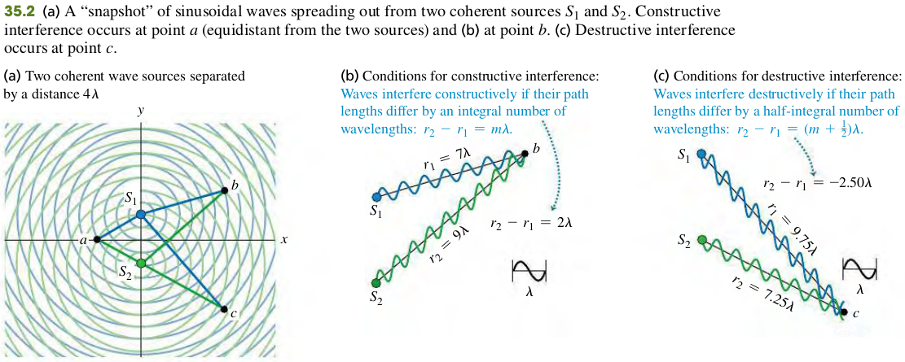
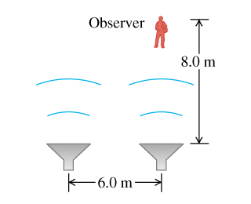

### 3501 Interference and coherent sources

#### Principle of superposition
When two or more waves overlap, the resultant displacement at any point and at any instant is found by adding the instantaneous displacements that would be produced at the point by the individual waves if each were present alone.

#### Constructive and Destructive Interference
Two monochromatic sources of the same frequency and with a constant phase relationship (not necessarily in phase) are said to be **coherent**.

In general, when waves from two or more sources arrive at a point in phase, they reinforce each other: The amplitude of the resultant wave is the sum of the amplitudes of the individual waves. This is called **constructive interference**.
$$
\begin{aligned}
r_2 - r_1 = m \lambda (m = 0, \pm 1, \pm 2 \cdots) &\quad\text{(35.1)}
\end{aligned}
$$

The resultant amplitude is the difference between the two individual amplitudes. If the individual amplitudes are equal, then the total amplitude is zero! This cancellation or partial cancellation of the individual waves is called **destructive interference**.
$$
\begin{aligned}
r_2 - r_1 = (m + \frac{1}{2}) \lambda (m = 0, \pm 1, \pm 2 \cdots) &\quad\text{(35.2)}
\end{aligned}
$$

#### Exercises
5, 6

35.5 Two speakers, emitting identical sound waves of wavelength 2.0 m in phase with each other, and an observer are located as shown in the figure (Figure 1).

(a) At the observer's location, what is the path difference for waves from the two speakers?
(b) Will the sound waves interfere constructively or destructively at the observer’s location—or something in between constructive and destructive?
>Solution
a. $\Delta x = 2 \text{ m}$.
b. $\Delta x = 1 \times \lambda$. Constructive.

35.6 Two light sources can be adjusted to emit monochromatic light of any visible wavelength. The two sources are coherent, 2.04 $\mu$m apart, and in line with an observer, so that one source is  2.04 $\mu$m farther from the observer than the other. (a) For what visible wavelengths (380 to 750 nm) will the observer see the brightest light, owing to constructive interference? (b) How would your answers to part (a) be affected if the two sources were not in line with the observer, but were still arranged so that one source is 2.04 $\mu$m farther away from the observer than the other? (c) For what visible wavelengths will there be destructive interference at the location of the observer?
>Solution
a. Let the path difference be $d = 2.04 \times 10^{-6}\text{m}$, and the wavelength be $\lambda | \lb 3.8 \times 10^{-7}, 7.5 \times 10^{-7}\rb$. FOr brightest light, we are looking for constructive interference where $d = m \lambda$.
$$
\begin{aligned}
\lambda &= \frac{d}{m}\\
 m &= 1 \To \lambda = 20.4 \times 10^{-6}\text{ nm}\\
 m &= 2 \To \lambda = 10.2 \times 10^{-6}\text{ nm}\\
 m &= 3 \To \lambda = 6.8 \times 10^{-6}\text{ nm}\\
 m &= 4 \To \lambda = 5.1 \times 10^{-6}\text{ nm}\\
 m &= 5 \To \lambda = 4.08 \times 10^{-6}\text{ nm}\\
 m &= 6 \To \lambda = 3.8 \times 10^{-6}\text{ nm}
 \end{aligned}
$$
The valid wavelength are $\lambda = 680\text{nm}, 510\text{nm}, 408\text{nm}, 380\text{nm}$.
b. Not affected.
c.For destructive interference $d = (m + \frac{1}{2} \lambda)$
$$
\begin{aligned}
\lambda &= \frac{d}{m + \frac{1}{2}}\\
m &= 1 \To \lambda = 13.6.4 \times 10^{-6}\text{ nm}\\
m &= 2 \To \lambda = 8.16 \times 10^{-6}\text{ nm}\\
m &= 3 \To \lambda = 5.83 \times 10^{-6}\text{ nm}\\
m &= 4 \To \lambda = 4.53 \times 10^{-6}\text{ nm}\\
m &= 5 \To \lambda = 3.71 \times 10^{-6}\text{ nm}
\end{aligned}
$$
The valid wavlength are $\lambda = 583\text{ nm}, 453\text{ nm}, 371\text{nm}$.
