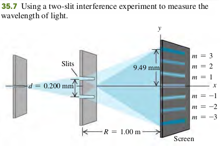

### 3502 Two-source Interference Of Light

#### Constructive and destructive two-Slit Interference
**Constructive interference, two slits**
$$
\begin{aligned}
d\sin\th = m \lambda \quad (m=0, \pm 1, \pm 2 \cdots) \quad \bold{(35.4)}
\end{aligned}
$$
$d$ - Distance between slits
$\th$ - Angle of line from slits to *m*th **bright** region on screen

**Destructive interference, two slits**
$$
\begin{aligned}
d\sin\th = (m + \frac{1}{2}) \lambda \quad (m=0, \pm 1, \pm 2 \cdots) \quad \bold{(35.5)}
\end{aligned}
$$
$d$ - Distance between slits
$\th$ - Angle of line from slits to *m*th **dark** region on screen

Let $y_m$ be the distance from the center of the patter ($\th = 0$) to the center of the *m*th bright band. Let $\th_m$ be the corresponding values of $\th$; then
$$
\begin{aligned}
y_m = R \tan \th_m
\end{aligned}
$$
The distance $y_m$ are often much smaller then the distance R from the slit to the screen. Hence $\th_m$ is very small, then $\tan \th_m \approx \sin \th_m$. Combining this with Eq. (35.4), we find that for _small angles only_
$$
\begin{aligned}
y_m = R \tan \th_m \approx R \sin \th_m = R \frac{m \lambda}{d} \quad (m=0, \pm 1, \pm 2 \cdots) \quad \bold{(35.6)}
\end{aligned}
$$

#### Examples
35.1 Figure 35.7 shows a two-slit interference experiment in which the slits are 0.200 mm apart and the screen is 1.00 m from the slits. The m = 3 bright fringe in the figure is 9.49 mm from the central fringe. Find the wavelength of the light.

Solve Eq. (35.6) for $\lambda$, for the case m = 3:
$$
\begin{aligned}
\lambda = \frac{y_md}{mR} = 633 \text{ nm}
\end{aligned}
$$

#### Exercises
7, 9, 12, 14, 59

35.7 Young’s experiment is performed with light from excited helium atoms $\lambda = 502$ nm). Fringes are measured carefully on a screen 1.20 m away from the double slit, and the center of the 20th fringe (not counting the central bright fringe) is found to be 10.6 mm from the center of the central bright fringe. What is the separation of the two slits?
>Solution
$$
\begin{aligned}
d\sin \th &= m \lambda\\
m &= 20\\
\lambda &= 5.02 \times 10^{-7} \text{m}\\
\th &= \arctan (\frac{10.6 \times 10^{-3}\text{m}}{1.2\text{ m}})\\
\To & d= \frac{m \lambda}{\sin \th}\\
&= 1.14 \text{ mm}
\end{aligned}
$$

35.9 Two slits spaced 0.450 mm apart are placed 75.0 cm from a screen. What is the distance between the second and third dark lines of the interference pattern on the screen when the slits are illuminated with coherent light with a wavelength of 500 nm?
>Solution
$\Delta y = L \dfrac{\lambda}{d} = 0.83 \text{ mm}$

35.12 Coherent light with wavelength 400 nm passes through two very narrow slits that are separated by 0.200 mm, and the interference pattern is observed on a screen 4.00 m from the slits.
(a) What is the width (in mm) of the central interference maximum?
(b) What is the width of the first-order bright fringe?
>Solution
The width of the central interference maximum can be determined by the distance between the two minimum interference (first-order dark fringe).

35.14 Coherent light that contains two wavelengths, 660 nm (red) and 470 nm (blue), passes through two narrow slits that are separated by 0.300 mm. Their interference pattern is observed on a screen 4.00 m from the slits. What is the distance on the screen between the first-order bright fringes for the two wavelengths?
>Solution
$$
\begin{aligned}
\Delta y &= L \frac{m \lambda_1}{d} - L \frac{m \lambda_2}{d}\\
&= 2.53 \text{ mm}
\end{aligned}
$$

35.59 Interference occurs with not only light waves but also all frequencies of electromagnetic waves and all other types of waves, such as sound and water waves. Suppose that your physics professor sets up two sound speakers in the front of your classroom and uses an electronic oscillator to produce sound waves of a single frequency. When she turns the oscillator on (take this to be its original setting), you and many students hear a loud tone while other students hear nothing. (The speed of sound in air is 340 m/s.) She then slowly moves one speaker away from you until it reaches a point at which you can no longer hear the tone. If she has moved the speaker by 0.34 m (farther from you), what is the frequency of the tone?
>Solution
When you no longer hear the tone, destructive interference of sound waves occurs at your point. The path difference between two sound source is $\Delta x = 0.34\text{m}$. With destructive Interference, we have
$$
\begin{aligned}
\Delta x &= (m + \frac{1}{2}) \lambda \quad (m=0, \pm 1, \pm 2, \cdots)\\
\lambda &= \frac{v}{f}\\
\To f &= \frac{mv}{\Delta x} = \frac{.5 \times 340}{0.34}\\
&= 500\text{Hz} \quad(m=0)
\end{aligned}
$$
