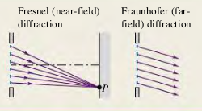

### 3601 Fresnel and Fraunhofer Diffraction
Diffraction occurs when light passes through an aperture or around an edge. When the source and the observer are so far away from the obstructing surface that the outgoing rays can be considered parallel, it is called _Fraunhofer diffraction_. When the source or the observer is relatively close to the obstructing surface, it is _Fresnel diffraction_.

#### Exercises
None
