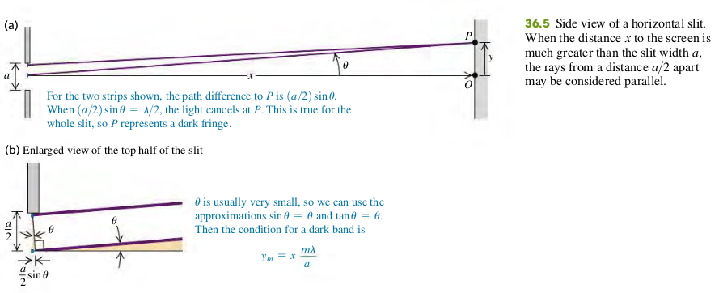

### 3602 Diffraction From a Single Slit
Monochromatic light sent through a narrow slit of width a produces a diffraction pattern on a distant screen. Equation (36.2) gives the condition for destructive interference (a dark fringe) at a point P in the pattern at angle u. Equation (36.7) gives the intensity in the pattern as a function of u. (See Examples 36.1–36.3.)

**Dark fringes, single slit diffraction**
$$
\begin{aligned}
\sin \th = \frac{m \lambda}{a} \quad (m=\pm 1, \pm 2, \cdots) \quad \bold{(36.2)}
\end{aligned}
$$
$\th$ - Angle of line from center of slit to *m*th dark fringe on screen
$a$ - Slit width
$\lambda$ - Wavelength
If the distance from slit to screen is $x$, the vertical distance of the *m*th dark band from the center of the patter is $y_m$, then $\tan \th = y_m/x$. For small $\th$ we may also approximate $\tan \th$ by $\th$ (in radians), We then find
$$
\begin{aligned}
y_m = x\frac{m \lambda}{a} \quad (y_m << x) \quad \bold{(36.3)}
\end{aligned}
$$

#### Examples
36.1  You pass 633-nm laser light through a narrow slit and observe the diffraction pattern on a screen 6.0 m away. The distance on the screen between the centers of the first minima on either side of the central bright fringe is 32 mm (Fig. 36.7). How wide is the slit?

>Solution
The first minimum corresponds to m = 1 in Eq. (36.3). The distance y 1 from the central maximum to the first minimum on either side is half the distance between the two first minima, so $y_1 = 32/2= 16$ mm. Solving Eq. (36.3) for $a$, we find
$$
\begin{aligned}
a = x\frac{\lambda}{y_1} = 0.24\text{ mm}
\end{aligned}
$$

#### Exercises
1, 2, 3, 5, 11

36.1 Monochromatic light from a distant source is incident on a slit 0.750 mm wide. On a screen 2.00 m away, the distance from the central maximum of the diffraction pattern to the first minimum is measured to be 1.35 mm. Calculate the wavelength of the light.
>Solution
Solving $y_m = x \dfrac{m \lambda}{a}$, for $\lambda$
$$
\begin{aligned}
\lambda &= \frac{y_m a}{x m}\\
y_m &= 1.35 \times 10^{-3} \text{ m}, a = 0.75 \times 10^{-3} \text{ m}, x = 2\text{m}, m = 1\\
\To \lambda &= 506.25 \text{ nm}
\end{aligned}
$$
