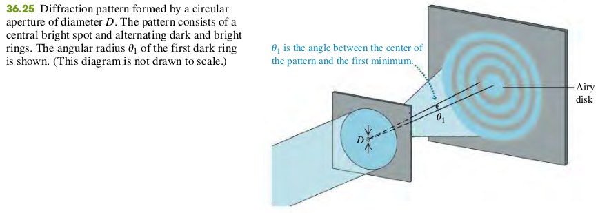

### 3607 Circular Apertures and Resolving Power
The diffraction pattern from a circular aperture of diameter *D* consists of a central bright spot, called the *Airy disk*, and a series of concentric dark and bright rings. Equation (36.17) gives the angular radius $\th_1$ of the first dark ring, equal to the angular size of the Airy disk. Diffraction sets the ultimate limit on resolution (image sharpness) of optical instruments. According to Rayleigh’s criterion, two point objects are just barely resolved when their angular separation $\th$ is given by Eq. (36.17).  (See Example 36.6.)

**Diffraction by a circular aperture**
$$
\sin \th_1 = 1.22 \frac{\lambda}{D} \quad \bold{(36.17)}
$$
$\th_1$ - Angular radius of first dark ring = Angular radius of Airy disk
$D$ - Aperture Diameter

#### Exercises
37, 38, 39, 40

36.37 Monochromatic light with wavelength 620 nm passes through a circular aperture with diameter 7.4 $\mu$m. The resulting diffraction pattern is observed on a screen that is 4.5 m from the aperture. What is the diameter of the Airy disk on the screen?
>Solution
The angular radius of Airy disk
$$
\begin{aligned}
\sin \th_1 &= 1.22 \frac{\lambda}{D}
\end{aligned}
$$
The radius of the Airy disk is
$$
\begin{aligned}
R &= L\tan \th_1 \approx L \sin\th_1\\
L &= 4.5 \text{m}, \lambda = 6.2 \times 10^{-7} \text{ m}, D = 7.4 \times 10^{-6} \text{ m}\\
\To R &= 46\text{ cm}
\end{aligned}
$$
The diameter of the Airy disk is 2R = 92 cm.

36.38 Monochromatic light with wavelength 490 nm passes through a circular aperture, and a diffraction pattern is observed on a screen that is 1.20 m from the aperture. If the distance on the screen between the first and second dark rings is 1.65 mm, what is the diameter of the aperture?
>Solution
Todo

36.39 Two satellites at an altitude of 1200 km are separated by 28 km. If they broadcast 3.6-cm microwaves, what minimum receiving-dish diameter is needed to resolve (by Rayleigh’s criterion) the two transmissions?
>Solution
Let the angle between the two lines from the dish to the two satellites be $\th$
$$
\begin{aligned}
\th &= 2\arcsin(\frac{14}{1200})\\
\sin \th &= 1.22 \frac{\lambda}{D}\\
\To D &= \frac{1.22 \lambda}{\sin \th} = 1.88 \text{ m}
\end{aligned}
$$

36.40 If you can read the bottom row of your doctor’s eye chart, your eye has a resolving power of 1 arcminute, equal 1 to 60 degree. If this resolving power is diffraction limited, to what effective diameter of your eye’s optical system does this correspond? Use Rayleigh’s criterion and assume $\lambda$ = 550 nm.
>Solution
Todo

36.62 The maximum resolution of the eye depends on the diameter of the opening of the pupil (a diffraction effect) and the size of the retinal cells. The size of the retinal cells (about 5.00 μm in diameter) limits the size of an object at the near point (25.0 cm ) of the eye to a height of about 50.0 μm . (To get a reasonable estimate without having to go through complicated calculations, we shall ignore the effect of the fluid in the eye.)
(a) Given that the diameter of the human pupil is about 2.0 mm, does the Rayleigh criterion allow us to resolve a 50 $\mu m$tall object at 25 cm from the eye with light of wavelength 550 nm?
(b) According to the Rayleigh criterion, what is the shortest object we could resolve at the 25-cm near point with light of wavelength 550 nm?
(c) What angle would the object in part (b) subtend at the eye? Express your answer in minutes (60 min = $1\degree$), and compare it with the experimental value of about 1 min.
(d) Which effect is more important in limiting the resolution of our eyes: diffraction or the size of the retinal cells?
>Solution
a. No
b. y = 84 $\mu$m
c. $\th = 1.16 \text{ min}$
d. Diffraction
